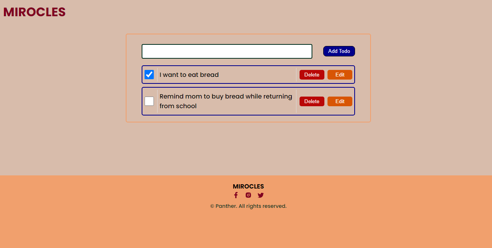

# Todo-App

## GENERAL INFORMATION

This is a simple project outlining a todo app with functions such as add, save, delete and edit. It generally accepts input from users and upon click of the add-todo button it saves the data in the local storage of a user and with a get request the saved data is populated in another container which is then displayed on the screen. Further-more, a user can add multiple todos to achieve within a given period and all data is saved and cannot be deleted upon page refresh due to the mechanism put in place. Hence until a user deletes, or edits saved data the data cannot be removed from his/her todo list. Finally, in general context this app is developed with simplicity to make the UI easily understandable and usable while also putting in place unique color combination to attract and keep a user focussed.

## Table of Content

* [General info](#general-information)
* [Table of Content](#table-of-content)
* [Introduction](#introduction)
* [Technologies](#technologies)
* [Illustration](#illustrations)
* [Scope of Functionalities](#scope-of-functionalities)
* [Project Status](#project-status)
* [Sources](#sources)
* [Getting Started with Create React App](#getting-started-with-create-react-app)
* [Launch](#launch)
* [Room For Improvement](#room-for-improvement)
* [Other Information](#other-information)

## Introduction

This documentation contains a well detailed scope of the project inclusive of future prospective in terms of advanced functionalities. In a step by step guide the technologies used in achieving this project, Illustrations on the functionalities and how to use the project will be stated below. This project currently focusses on a simple todo app which could be used as a bucket list to itemized a list of important activities to be carried with easy access to user and security to data within the time frame of its execution.  

## Technologies

This projects was done with the following technologies.

1. VScode v1.70.1
2. React JS
3. CSS

## Illustrations

Image showing the main page of Todo App.

## Scope of Functionalities

### Features

* A simple todo app with unique color to keep the minds of users on the site.
* Well crafted Interface with good communication between users and the system.
* Easy utilization of functionalities to meet users needs.
* A responsive websites with several device compactability. Typically Desktop, Tablet and Mobile.

## Project Status

The project is currently completed since the main focus was to develop a working Todo App. However, the developer intends to add more features to make the page a site to visit.

## Sources

This project was inspired by SeamFix NextGen Programe. But became a reality through several sources on Youtube and Google. For example;

* [Stack-Overflow](https://stackoverflow.com)
* [Code boost](https://www.youtube.com/watch?v=EbnmosN64JQ)
* [Ganesan C](https://www.c-sharpcorner.com/article/how-to-deploy-react-application-on-github-pages/)

# Getting Started with Create React App

This project was bootstrapped with [Create React App](https://github.com/facebook/create-react-app).

## Available Scripts

In the project directory, you can run:

### `npm start`

Runs the app in the development mode.\
Open [http://localhost:3000](http://localhost:3000) to view it in your browser.

The page will reload when you make changes.\
You may also see any lint errors in the console.

### `npm test`

Launches the test runner in the interactive watch mode.\
See the section about [running tests](https://facebook.github.io/create-react-app/docs/running-tests) for more information.

### `npm run build`

Builds the app for production to the `build` folder.\
It correctly bundles React in production mode and optimizes the build for the best performance.

The build is minified and the filenames include the hashes.\
Your app is ready to be deployed!

See the section about [deployment](https://facebook.github.io/create-react-app/docs/deployment) for more information.

### `npm run eject`

**Note: this is a one-way operation. Once you `eject`, you can't go back!**

If you aren't satisfied with the build tool and configuration choices, you can `eject` at any time. This command will remove the single build dependency from your project.

Instead, it will copy all the configuration files and the transitive dependencies (webpack, Babel, ESLint, etc) right into your project so you have full control over them. All of the commands except `eject` will still work, but they will point to the copied scripts so you can tweak them. At this point you're on your own.

You don't have to ever use `eject`. The curated feature set is suitable for small and middle deployments, and you shouldn't feel obligated to use this feature. However we understand that this tool wouldn't be useful if you couldn't customize it when you are ready for it.

## Learn More

You can learn more in the [Create React App documentation](https://facebook.github.io/create-react-app/docs/getting-started).

To learn React, check out the [React documentation](https://reactjs.org/).

### Code Splitting

This section has moved here: [https://facebook.github.io/create-react-app/docs/code-splitting](https://facebook.github.io/create-react-app/docs/code-splitting)

### Analyzing the Bundle Size

This section has moved here: [https://facebook.github.io/create-react-app/docs/analyzing-the-bundle-size](https://facebook.github.io/create-react-app/docs/analyzing-the-bundle-size)

### Making a Progressive Web App

This section has moved here: [https://facebook.github.io/create-react-app/docs/making-a-progressive-web-app](https://facebook.github.io/create-react-app/docs/making-a-progressive-web-app)

### Advanced Configuration

This section has moved here: [https://facebook.github.io/create-react-app/docs/advanced-configuration](https://facebook.github.io/create-react-app/docs/advanced-configuration)

### Deployment

This section has moved here: [https://facebook.github.io/create-react-app/docs/deployment](https://facebook.github.io/create-react-app/docs/deployment)

### `npm run build` fails to minify

This section has moved here: [https://facebook.github.io/create-react-app/docs/troubleshooting#npm-run-build-fails-to-minify](https://facebook.github.io/create-react-app/docs/troubleshooting#npm-run-build-fails-to-minify)

## Launch

To run this project on your local machine, simply follow the steps below.

* Install [Vscode](https://code.visualstudio.com/)
* Go to [GitHub](https://github.com/Emmanuel-obiora/todo-app)
* Click on CODE and copy the HTTPS link to clone the project.
* From your VScode terminal clone the project
* Finally click GO Live to view on browser if live server is installed.
* Else right click on the index file and click on open with (any browser installed on your pc would show here)

Or you can view the published work by clicking this link [todo-app](https://emmanuel-obiora.github.io/todo-app/)

## Room For Improvement

* Adding more features to the projects.
* Sucuring user data with signin interface.

### To-Do

* Pop-up for every response rather than alert.

## Other Information

### Author

👤 **Obiora Emmanuel**

* GitHub: [Emmanuel-obiora](https://github.com/Emmanuel-obiora)
* Twitter: [Miroclesdgenius](https://twitter.com/Miroclesdgenius)
* LinkedIn: [obiora-emmanuel](https://www.linkedin.com/in/obiora-emmanuel-b4935616a/)

### Show your support

Give a ⭐️ if you like this project!

### 📝 License

This project is [MIT](https://docs.github.com/en/github/creating-cloning-and-archiving-repositories/licensing-a-repository) licensed.
